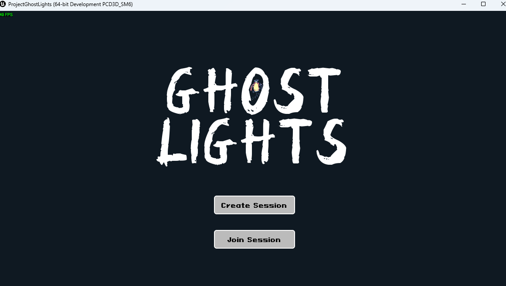

# Ghost Lights: Multiplayer Action Beat-'Em-Up (Tech Demo)

**Solo Graduate Capstone Project** | Developed in **Unreal Engine 5**  
Development Time: [01/2025] – [05/2025]  

---

## ⚙️ Project Overview

*Ghost Lights* is a **solo-developed gameplay tech demo** created to explore core systems for a 2D multiplayer action-platformer. Set in a haunted amusement park, players use colored light-based abilities to interact with enemies and environments in dynamic ways.

The project focuses on building a **playable foundation** for multiplayer combat, character systems, and UI.

---

## 🧠 Role & Focus Areas

This project was built entirely by me as a demonstration of technical and design skills in gameplay and UI engineering.

### 🔧 Gameplay Systems
- Designed and implemented the **color-interaction mechanic**: enemies respond differently to player light color.
- Developed player movement, input handling, and hit detection using Blueprint.
- Integrated **PaperZD** for animation state machines with sprite-based characters.

### 🔌 Networking & Architecture
- Configured and implemented core **multiplayer networking logic**:
  - Replication of character states, light effects, and player interactions.
  - Synchronized multiplayer session flow through custom `GameMode`, `GameState`, and `PlayerController`.

### 🖥️ UI/UX Engineering
- Built the **UI layout** system including:
  - **Lobby screen** with synced character selection.
  - **In-game HUD** showing health and active colors.
---

## 🛠️ Tools & Tech Used

- Unreal Engine 5 (Blueprint)
- PaperZD (2D animation tools)
- Diversion (version control system designed for game development)

---

## 📸 Screenshots

- Main Menu
> 
- Character Select
> 
- Game Menu
> 
- Gameplay
> > 
---

## 📽️ Demo

> 

---

## 📝 Key Takeaways

- Built a functional, extensible multiplayer framework from the ground up.
- Developed all gameplay systems, UI/UX, and backend architecture solo.
- Gained hands-on experience bridging **technical implementation and player interaction**.
